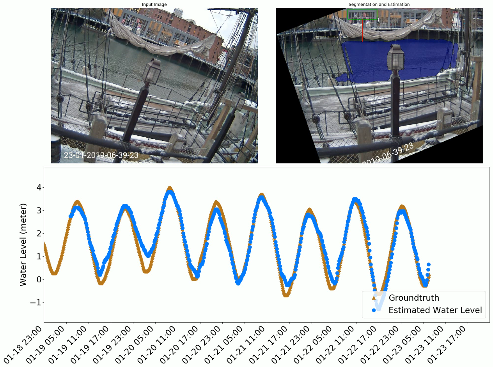

# V-FloodNet

This is an official PyTorch implementation for paper "V-FloodNet: A Video Segmentation System for Urban Flood Detection and Quantification". A robust automatic system for water level or inundation depth estimation from images and videos, consisting of reliable
water and reference object detection/segmentation, and depth estimation models. 

Here are some screenshots of our results. We can estimate water depth from the detected objects in the scene.


We can also estimate water level from from long videos under various weather and illumination conditions.


More demo videos are available in [Google Drive](https://drive.google.com/drive/folders/1DURwcb_qhBeWYznTrpJ-7yGJTHxm7pxC?usp=sharing) under the `animation_videos` folder.

## 1 Environments

### 1.1 Code and packages
We developed and tested the source code on Ubuntu 18.04 and PyTorch framework. Nvidia GPU with driver is required.

For Windows users, running our code on WSL2 subsystem is recommended. Because part of our code has GUI window, you need to install X Server on Windows. Please refer to [this post](https://techcommunity.microsoft.com/t5/windows-dev-appconsult/running-wsl-gui-apps-on-windows-10/ba-p/1493242) for instructions.

The following packages are required to run the code. First, git clone this repository
```bash
git clone https://github.com/xmlyqing00/V-FloodNet.git
```

Second, a python virtual environment is recommended. 
I use `pip` to create a virtual environment named `env` and activate it. Using `conda` to create a virtual environment with `python=3.8` is recommended.
Then, recursively pull the submodules code.

```shell
python3 -m venv vflood
source vflood/bin/activate
git submodule update --init --recursive
```

In the virtual environment, install the following required packages from their official instructions.

- torch, torchvision, from [PyTorch](https://pytorch.org). We used v1.8.2+cu111 is used in our code. 
- [PyTorch Scatter](https://github.com/rusty1s/pytorch_scatter) for scatter operations. We used the version for torch 1.8.1+cu111. 
- [Detectron2](https://github.com/facebookresearch/detectron2) for reference objects segmentation. We use version 0.6 here.
- [MeshTransformer](https://github.com/microsoft/MeshTransformer) for human detection and 3D mesh alignment.

We provide the corresponding installation command here. Please masure sure the **version number** fits your environment. 

```shell
# Install essential libaries
sudo apt install build-essential libosmesa6-dev libgl1-mesa-dev libglu1-mesa-dev freeglut3-dev

# Install PyTorch
pip install torch==1.8.2+cu111 torchvision==0.9.2+cu111 torchaudio==0.8.2 -f https://download.pytorch.org/whl/lts/1.8/torch_lts.html
pip install torch-scatter==2.0.8 -f https://data.pyg.org/whl/torch-1.8.1+cu111.html -v

# Install Detectron2
pip install detectron2 -f https://dl.fbaipublicfiles.com/detectron2/wheels/cu111/torch1.8/index.html

# Install MeshTransformer, make sure you are in the folder of this repository.
cd MeshTransformer
python setup.py build develop
pip install ./manopth/.
cd ..

# Install other python packages
pip install -r requirements.txt
```


### 1.2 Pretrained Models

First, run the following script to download the pretrained models of MeshTransformer
```bash
sh scripts/download_MeshTransformer_models.sh
```

Second, download SMPL model `mpips_smplify_public_v2.zip` from the official website [SMPLify](http://smplify.is.tue.mpg.de/). Extract it and copy the model file `basicModel_neutral_lbs_10_207_0_v1.0.0.pkl` from `smplify_public/code/models/` to `V-FloodNet/MeshTransformer/metro/modeling/data/`.

Third, download the archives from [Google Drive](https://drive.google.com/drive/folders/1DURwcb_qhBeWYznTrpJ-7yGJTHxm7pxC?usp=sharing).
1. Extract the pretrained models for water segmentation `records.zip` and put them in the folder `V-FloodNet/records/`. 
2. Extract the water dataset `WaterDataset` in any path, which includes the training images and testing videos. You can put it at `V-FloodNet/WaterDataset/`.

Now the file structure looks like
```
V-FloodNet/
  -- MeshTransformer/
    -- metro/
      -- modeling/
        -- data/
          -- basicModel_neutral_lbs_10_207_0_v1.0.0.pkl
  -- records/
    -- groundtruth/
    -- link_efficientb4_model.pth
    -- video_seg_checkpoint_20200212-001734.pth
    ...
  -- WaterDataset/
    -- train_images/
    -- test_videos/
  ...
```


## 2 Usage

### 2.1 Water Image Segmentation
Put the testing images in a folder then
```shell
python test_image_seg.py --test-path=/path/to/image/folder --test-name=<anyname>
```
The default output folder is `output/segs/`

### 2.2 Water Video Segmentation
If your input is a video, we provide a script `scripts/cvt_video_to_imgs.py` to extract frames of the video.
Put the extracted frames in a folder then
```shell
python test_video_seg.py --test-path=/path/to/image/folder --test-name=<anyname>
```

More arguments can be found in `python test_video_seg.py --help`.

Note that the `--budget` argument controls the maximum number of features that can be stored in GPU memory for adaptive feature bank. The default value `3000000` is an experimental number for 11GB GPU memory.

### 2.3 Water Depth Estimation

Arguments for water depth estimation

1. `--test-path` indicates the path to the image forder.
2. `--test-name` here should be consistent with the above segmentations.
3. `--opt`: should be one of the three options `stopsign`, `people`, and `ref` to specify three types reference objects. 
```shell
python est_waterlevel.py --test-path=/path/to/image/folder --test-name=<anyname> --opt=<opt>
```

This is an optional step. For input video, to compare the estimated water level with the groundtruths in `records/groundtruth/`, you can use 
```shell
python scripts/cmp_hydrograph.py --test-name=<anyname>
```

## 3 Training

Retrain the model from scratch or your own data could take a long time for weeks. We strongly recommend you used our pretrained model for inferring.
To train the image segmentation module, please refer to the `train_image_seg.py`
```
python train_image_seg.py \
  --dataset-path=/path/to/Datasets/WaterDataset/train_images/ \
  --encoder=efficientnet-b4
```

To train the video segmentation module, please refer to the `train_video_seg.py`. We provide an initial training point in [Google Drive](https://drive.google.com/file/d/1l9TXNV4YQMAxL8RqfL14-qofn_s641Dx/view?usp=sharing), where the network weights are pretrained on large general videos.
We use the following parameters to train our model
```
python train_video_seg.py \
  --dataset=/path/to/WaterDataset/train_images \
  --resume=./records/level2_YouTubeVOS.pth \
  --new --log
```

## 4 Copyright
This paper is submitted to Elsevier Journal Computers, Environment and Urban Systems under review. The corresponding author is Xin Li (Xin Li <xin.shane.li@ieee.org>).  All rights are reserved.
